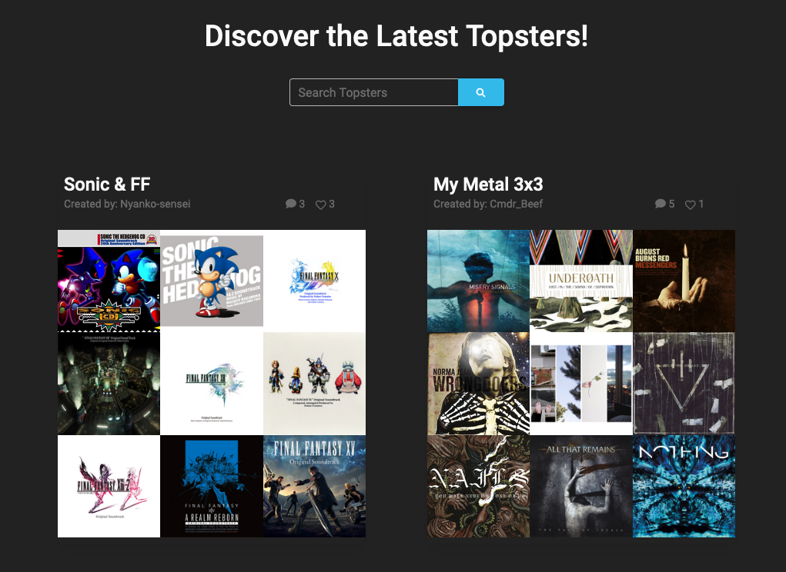

# Run-cmc

# About
Run-CMC is short for "Run a Curated Music Collage". It is a full-stack application designed to allow users to use album art from their favorite artist to create their own works of art and at the same time discover new music. As a user you can view the most popular user creations, click on album art, and get details about the artist and release date information. As a registered user you can create a profile, create CMC artwork, and click on individual album art and be taken to Spotify to listen to that album. In addition, a registered user can comment, and favorite creations. 

# Technologies Used
- Java
- MySQL
- Spring Boot
- Thymeleaf
- JavaScript
- HTML
- CSS
- Material Design Bootstrap

# APIs
- Spotify Web API
- Filestack API

# New Features In Development
- Ability to edit topsters you created, changing arrangement, size, and contents as desired
- New fetch-based 'Favorite' solution which will not cause a page reload
- Minor styling improvements
- Ability to view the profile pages of other users when logged in. Links will be bound to their names wherever a username is displayed by a topster they created
